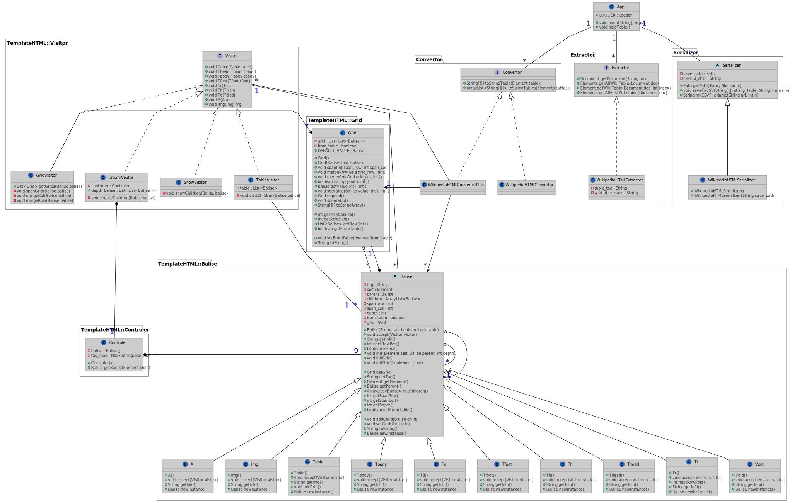

# Wikipedia Matrix

## The project

The goal of this project is to convert Wikipedia tables into the CSV format. Essentially we want a function that takes the URL of a Wikipedia page and saves all relevant tables to the CSV format. 
Actually, this application has two interfaces to access its convertor. It can be packaged into a jar file and added as a dependency to another java project. Also, it’s a spring-boot application. A Rest API can be run to access CSV as a list of strings.

## Running the App

This converter uses maven so you can test, build and run easily.

To do so, open a terminal at the root of the project.

1. Testing: 
    ```
    cd wikimatrix 
    mvn test
    ``` 
2. Building:
    ```
    cd wikimatrix 
    mvn clean package
    ```
3. Running:
    ```
    cd wikimatrix 
    mvn spring-boot:run
    ```

## The Rest API interface

After running the Srping-boot application, you can access the Rest API at this [link](localhost:8080/)

<b>This is a Rest API that all you to get Wikipedia tables in an array-like form convertible to CSV. </b><br>

- Got to \"<b>/table_index?name=(Wikipedia page name)&index=(index of the table among wikitables)</b>\" <br>
to get the specific table you want from the Wikipedia page. A list of list is returned being the rows and the columns.<br><br>
- Got to \"<b>/table_all?name=(Wikipedia page name)</b>\" <br>
to get all the tables from the Wikipedia page. A 3D List is returned being the tables, the rows and the columns.<br><br>
- You can add \"<b>/reformat</b>\" at the right of \"<b>/table_index</b>\" or \"<b>/table_all</b>\" to get an HTML view of the transformed table.

## Challenges

Converting Wikipedia tables from HTML to CSV format is not an easy task, as choices and compromises as been made. 

### First view of the problem

In order to access the HTML content of Wikipedia pages, we used Jsoup. This package allows an easy way to navigate in the DOM. 
However, HTML tables are way more versatile than the CSV format can afford. View the example bellow
                           
<table>
<tr>
<td></td>
<td><center>HTML</center></td>
<td><center>Into</center></td>
<td><center>CSV</center></td>
</tr>
<tr>
<td>Code</td>
<td>

```                             
<table class="wikitable">       
    <tr>                        
        <td>a</td>              
        <td>b</td>              
        <td>c</td>              
    </tr>                       
    <tr>                        
        <td>d</td>              
        <td colspan=2>e</td>    
    </tr>                       
</table>                        
```  

</td>

<td rowspan="2"> <font size="20">→<font></td>

<td>
<center>
    "a","b","c"<br>
    "d","e","e"
</center>
</td>

</tr>
<tr>
<td>Render</td>
<td>
<center>
<table class="wikitable">       
    <tr>                        
        <td>a</td>              
        <td>b</td>              
        <td>c</td>              
    </tr>                       
    <tr>                        
        <td>d</td>              
        <td colspan="2"><center>e</center></td>    
    </tr>                       
</table>   
</center>
</td>

<td>
<center>
<table class="wikitable">       
    <tr>                        
        <td>a</td>              
        <td>b</td>              
        <td>c</td>              
    </tr>                       
    <tr>                        
        <td>d</td>              
        <td>e</td>    
        <td>e</td> 
    </tr>                       
</table>   
</center>
</td>
</tr>
</table>  

As we can see, the cell named "e" is duplicated in the CSV form. In fact, the multicell can't be represented in CSV. We made the choice to just duplicate the value. 
HTML tables can be very tricky as you can see on the [Help table](https://en.wikipedia.org/wiki/Help:Table) web page of Wikipedia.
Cells can span multiple rows and/or columns. Also, tables can be nested as far as we want. So one cell can have a table in it, and this cell can span multiple cells. This situation cannot be represented in CSV like in HTML. So we choose to duplicate rows and columns in order to have the space to fit the data and keep links between rows and columns. An example of the situation of a nested table is given below:

<table>
<tr>
<td></td>
<td><center>HTML</center></td>
<td><center>Into</center></td>
<td><center>CSV</center></td>
</tr>
<tr>
<td>Code</td>
<td>

```                             
<table class="wikitable">
    <tr>
        <td>a</td>
        <td>b</td>
        <td>c</td>
    </tr>
    <tr>
        <td>e</td>
        <td>f</td>
        <td>g</td>
    </tr>
    <tr>
        <td>d</td>
        <td colspan=2>
            <table class="wikitable">
                <tr>
                    <td>a1</td>
                    <td>b1</td>
                </tr>
                <tr>
                    <td colspan=2>c1</td>
                </tr>
            </table>
        </td>
    </tr>
</table>                     
```  

</td>

<td rowspan="2"> <font size="20">→<font></td>

<td>
<center>
    "a","b","b","c","c"<br>
    "e","f","f","g","g"<br>
    "d","a1","a1","b1","b1"<br>
    "d","c1","c1","c1","c1"
</center>
</td>

</tr>
<tr>
<td>Render</td>
<td>
<center>
<table class="wikitable">
    <tr>
        <td>a</td>
        <td>b</td>
        <td>c</td>
    </tr>
    <tr>
        <td>e</td>
        <td>f</td>
        <td>g</td>
    </tr>
    <tr>
        <td>d</td>
        <td colspan=2>
            <table class="wikitable">
                <tr>
                    <td>a1</td>
                    <td>b1</td>
                </tr>
                <tr>
                    <td colspan=2>c1</td>
                </tr>
            </table>
        </td>
    </tr>
</table> 
</center>
</td>

<td>
<center>
<table class="wikitable">       
    <tr>                        
        <td>a</td>              
        <td>b</td> 
        <td>b</td>              
        <td>c</td>  
        <td>c</td>              
    </tr> 
    <tr>                        
        <td>e</td>              
        <td>f</td> 
        <td>f</td>              
        <td>g</td>  
        <td>g</td>              
    </tr> 
    <tr>                        
        <td>d</td>              
        <td>a1</td> 
        <td>a1</td>              
        <td>b1</td>  
        <td>b1</td>              
    </tr> 
    <tr>                        
        <td>d</td>              
        <td>c1</td> 
        <td>c1</td>              
        <td>c1</td>  
        <td>c1</td>              
    </tr>                                        
</table>   
</center>
</td>
</tr>
</table> 

So we flatten tables in order to convert them into CSV. This flattening is performed from the bottom up so that no matter how many nested tables there are, all data will be present in the right place.

Moreover, as you can see at [Help table](https://en.wikipedia.org/wiki/Help:Table), tables can contain different types of data. They can be images, videos, links, or any other HTML content. In this project, we focused on making a modular application that can evolve to take into account more tables and data. In this view, we already implemented the support for "text", "links" and "images". Those types need to be converted to text somehow in order to fit CSV files. For "links" we take the "href" attribute and for "images" the "src" one that we append to the text. This behavior can easily be changed.  

## Architecture

The architecture of this app is <b>four</b> main parts:

1. The EXTRACTOR take the URL of a Wikipedia page and output table elements with all their respective children. Multiples options allow the user to get only one table according to the index or to return all tables on the page.<br>
<b>NB</b>: Returned tables in the second case don’t contain tables that are nested in other ones.

2. The CONVERTOR takes a table or a list of tables and outputs them as a table of string. 

3. The SERIALIZER saves string tables into CSV files at the default or wanted location. 

4. The WEB creates the web interface thanks to Spring-boot that uses the two first parts to convert HTML to CSV. 

Here is the class diagram of the core project. The test and the web part are not included. 



We found the three first parts of the core at the top right. But the conversion is done mostly in the `WikipediaHTMLConvertorPlus` class.

The first idea is to reproduce the HTLM tree structure in java. This is done by the `Balise` class that store other balise as children or parent. For each type of HTML balise exists a `Balise` class that mimics the corresponding HTML behaviors. To make the correspondence between the HTML tag and the `Balise` class, the `Controller` uses a predefined `HashMap`.
To create and then explore this tree a visitor pattern is used. To convert from HTML to CSV we first create the tree by using the `CreateVisitor`. Then we calculate the grid of each balise (except table ones) with the `GridVisitor`. After that, we calculate only tables grids thanks to the `TableVisitor`. Finally, the first table in the tree is expanded (if there is nested tables) to make the final grids of balise. Finally, the grid of balise is transformed to a grid of strings that is returned. 

## Testing

We give 300+ Wikipedia URLs and the challenge is to:
 * integrate the extractors' code (HTML and Wikitext)
 * extract as many relevant tables as possible 
 * serialize the results into CSV files (within `output/html` and `output/wikitext`) 
 
More details can be found in `BenchTest.java`. We are expecting to launch `mvn test` and the results will be in `output` folder 

## Limitations

One limitation of the actual application is its liimited "knowledge" of HTML. In fact, only 9 HTML balise are taken into account by the convertor. However, adding new balise is easy.
Also, nested tables are not quite fully supported. The issue is that when two ore more nested tables are on the same row or columns and don't have the same dimensions, empty cells are created to fill the gaps. The logical way being that each and every row/col of the first table must correspond to each and every row/col of the second. The behaviour was hard to implement but can be added in the `expend()` method of the class `grid`. However, in this case, tables sizes can grow exponentialy to the number of nested tables. 


